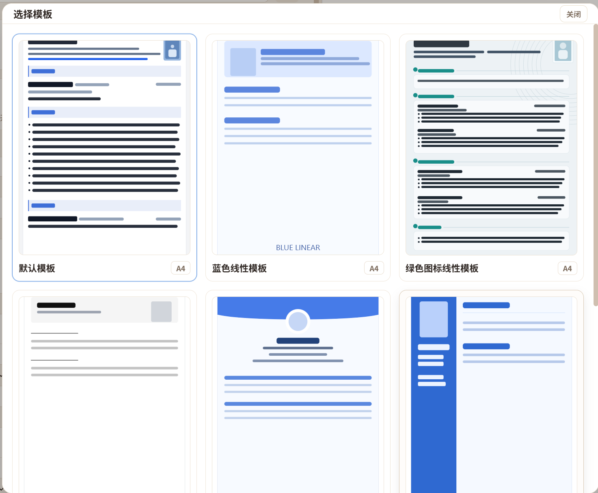
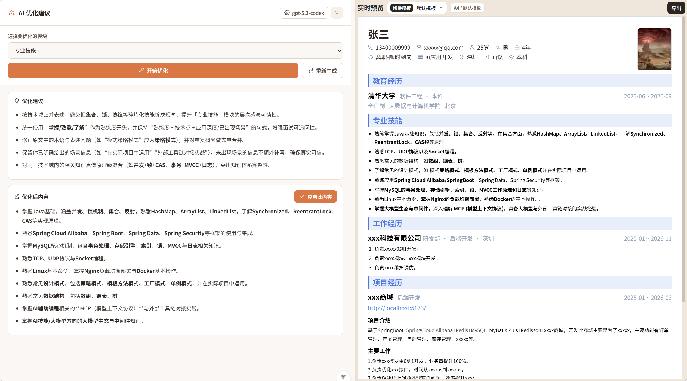
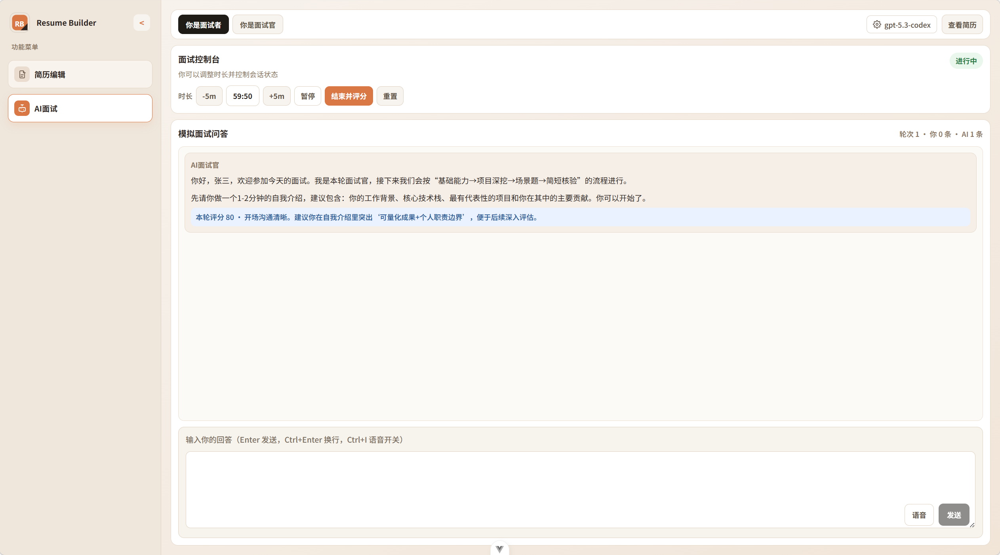

# Resume Builder

一个基于 Vue 3 + Vite 的简历编辑与 AI 面试一体化工具。

当前版本包含两大主菜单：
- `简历编辑`
- `AI面试`

## 核心能力

### 1) 简历编辑
- 模块化编辑：基本信息、教育经历、专业技能、工作经历、项目经历、荣誉奖项、个人简介。
- 模块开关与顺序调整：支持可见性切换与拖动式上下调整（基础信息固定在首位）。
- 实时完整度统计：根据已启用模块动态计算简历完整度。
- 自动本地保存：编辑内容自动持久化到 `localStorage`，支持手动“保存草稿”。
- 模板切换：内置 8 套简历模板。
- 导出能力：
  - 高清 PDF
  - 压缩 PDF
  - Markdown

### 2) AI 优化（简历编辑内）
- 支持 OpenAI 兼容接口的模型配置（`API URL` / `API Key` / `Model`）。
- 按模块发起 AI 优化（流式返回）。
- 输出分为“优化建议”和“优化后内容”。
- 一键应用优化结果，并支持撤回。
- 当前可直接应用的模块：`skills`、`selfIntro`、`workExperience`、`projectExperience`、`awards`。

### 3) AI 面试
- 双模式切换：
  - `你是面试者`（AI 扮演面试官）
  - `你是面试官`（AI 扮演候选人）
- 面试控制台：开始、暂停/继续、重置、结束并评分，支持时长 `-5m/+5m` 调整。
- 计时规则：总时长限制 15~120 分钟，倒计时结束可自动触发收尾评估。
- 多轮对话与流式回答渲染，支持 Markdown 展示。
- 语音输入：支持浏览器语音识别，快捷键 `Ctrl + I` 开关语音。
- 快捷输入：`Enter` 发送，`Ctrl + Enter` 换行。
- 面试结束后输出综合评分（含分项得分与改进建议）。

## 界面截图

### 模板选择



### 简历编辑


### AI 优化



### AI 面试



## 内置模板

- 默认模板
- 蓝色线性模板
- 绿色图标线性模板
- 黑白线性模板
- 通用职场模板
- 蓝色侧栏职场模板
- 蓝色分栏专业模板
- 蓝色卡片模板

## 内置 Skills 用法（Codex）

项目内置了 3 个技能文件，位于 `.codex/skills`：

- `resume-template-from-image`
- `resume-backend-project-optimizer`
- `resume-interview-coach`

### 1) resume-template-from-image（重点）

**适用场景**
- 你给一张/多张简历模板图片，希望 AI 在当前仓库里直接创建可用新模板。

**最小输入**
- 模板图片（必需）
- 模板名称（必需）
- 可选：`key`（不填会自动生成 kebab-case）

**一键使用方式（推荐）**
1. 在和 Codex 的对话里上传模板图片。
2. 直接发指令：请使用 `resume-template-from-image` 按图片在项目内创建模板。
3. 附上模板名称（可选再补 key/风格细节）。

**示例提示词**
```text
/resume-template-from-image + 模板图片 + 模板名称
```

**执行后会在项目内自动完成**
- 生成模板组件：`src/templates/resume/<key>/ResumeTemplate.vue`
- 生成模板定义：`src/templates/resume/<key>/template.ts`
- 生成模板预览图：`src/assets/templates/resume/<key>-preview.svg`
- 自动注册到 `src/templates/resume/index.ts`（可在模板选择器直接切换）

**关键规则（已内置在 skill 中）**
- 只复用现有 `store` 字段，不新增数据模型字段。
- 模块顺序跟随编辑区（`basicInfo` 固定第一，其余按 `moduleOrderStyle`）。
- `skills/selfIntro/work/project/award/education` 富文本字段按 `v-html` 渲染。
- 预览图必须是真实骨架 SVG，不允许空白图或占位图。

### 2) resume-backend-project-optimizer

**适用场景**
- 你有中文后端项目描述，想改成“可面试追问 + 强数据化”的简历要点。

**使用方式**
- 在对话中贴出项目经历原文（职责、技术、结果越具体越好）。
- 明确要求使用 `resume-backend-project-optimizer` 输出。

**输出特点**
- 按“负责功能 + 技术细节组合 + 解决问题 + 量化结果”重写。
- 技术关键词和指标自动加粗，支持“待补字段”占位，避免虚构数据。

### 3) resume-interview-coach

**适用场景**
- 你要做技术面试准备，想把项目经历打磨成可攻可守的话术。

**使用方式**
- 贴项目经历或简历段落，并要求使用 `resume-interview-coach`。

**输出特点**
- 4 步输出：业务诊断、连环追问、STAR 满分回答、简历防御建议。
- 强调真实生产视角（监控、链路、故障、兜底），便于面试深挖。

## 技术栈

- 前端框架：Vue 3（Composition API）
- 构建工具：Vite
- 状态管理：Pinia
- 类型系统：TypeScript + vue-tsc
- 代码质量：ESLint + Oxlint + Oxfmt
- 导出：html2canvas + jsPDF
- Markdown 渲染：markdown-it

## 运行环境

- Node.js: `^20.19.0 || >=22.12.0`
- npm: 建议使用最新稳定版

## 快速开始

```bash
npm install
cp .env.example .env
npm run dev
```

默认开发地址：`http://localhost:5173`

### 环境变量

云同步依赖 Supabase，请在 `.env` 中配置：

```bash
VITE_SUPABASE_URL=https://your-project.supabase.co
VITE_SUPABASE_ANON_KEY=your-supabase-anon-key
```

未配置时，本地简历编辑、模板预览、导出和 AI 功能仍可使用；登录同步和题库云同步会提示缺少 Supabase 配置。

## Docker 一键部署

确保已安装 [Docker](https://www.docker.com/)，在项目根目录执行：

```bash
# 构建并启动
docker compose up --build -d

# 访问应用
# http://localhost:3000

# 停止并清理
docker compose down
```

## 常用脚本

```bash
# 开发
npm run dev

# 构建（含类型检查）
npm run build

# 仅构建前端产物
npm run build-only

# 预览构建产物
npm run preview

# 类型检查
npm run type-check

# 代码检查（oxlint + eslint）
npm run lint

# 代码格式化
npm run format
```

## AI 配置说明

在"AI优化"或"AI面试"中点击"配置模型"，填写：
- `API URL`（无需手动拼 `/v1/chat/completions`，系统会自动补全）
- `API Key`
- `Model Name`

配置会保存在本地浏览器存储中。

## 简历云同步

支持将简历数据同步到云端，实现多设备同步和多版本管理。

### 功能特点
- **云端存储**：简历数据保存在 Supabase 云端
- **多版本管理**：支持创建、切换、删除简历版本（如"校招版"、"社招版"）
- **跨设备同步**：登录账号后，在任意设备都能访问自己的简历

### 使用方式
1. 点击侧边栏"登录同步"按钮
2. 注册账号或登录已有账号
3. 首次登录时会自动创建第一个版本
4. 可在"版本管理"中创建新版本或切换版本
5. 修改内容后点击"保存"，数据自动同步到云端

### 技术实现
- 使用 [Supabase](https://supabase.com/) 作为后端服务
- 数据存储在 `resumes` 表中，支持 JSON 格式完整存储
- 支持多用户、多版本管理

### 注意事项
- 如使用邮箱注册，需在 Supabase 后台 **Authentication → Providers** 中开启 **Email** 登录
- 免费额度足够个人使用

## 题库云同步

面试题库支持把“自定义/AI 生成题、我的回答、练习备注、掌握状态、AI 点评”同步到云端。登录后在面试题库顶部点击“拉取”或“上传”即可手动同步。

### Supabase 表结构

需要在 Supabase SQL Editor 中创建 `question_bank_states` 表：

```sql
create table if not exists question_bank_states (
  user_id uuid primary key references auth.users(id) on delete cascade,
  data jsonb not null,
  updated_at timestamptz not null default now()
);

alter table question_bank_states enable row level security;

create policy "Users can read own question bank"
on question_bank_states for select
using (auth.uid() = user_id);

create policy "Users can insert own question bank"
on question_bank_states for insert
with check (auth.uid() = user_id);

create policy "Users can update own question bank"
on question_bank_states for update
using (auth.uid() = user_id)
with check (auth.uid() = user_id);
```

## 项目结构

```text
src/
  components/
    ai/
      interview/        # AI 面试主界面与子组件
    resume/             # 简历编辑区、预览区、模板选择
    common/             # 通用组件（侧边栏、富文本等）
  services/
    prompts/            # AI 提示词（简历优化 / 面试）
    aiService.ts        # 简历模块 AI 优化
    interviewService.ts # AI 面试请求与响应归一化
    exportMarkdown.ts   # Markdown 导出
  stores/
    resume.ts           # 简历数据与模块配置
    aiConfig.ts         # AI 配置
  templates/resume/     # 简历模板注册与实现
```

## 注意事项

- 当前是纯前端项目，简历与 AI 配置默认保存在浏览器本地。
- 语音输入依赖浏览器语音识别能力，部分浏览器可能不支持。

## 友情链接

- [LINUX DO](https://linux.do/)

## License

MIT
