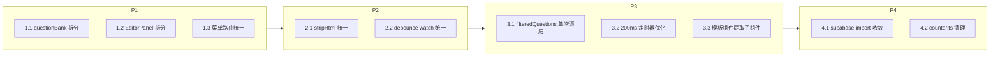
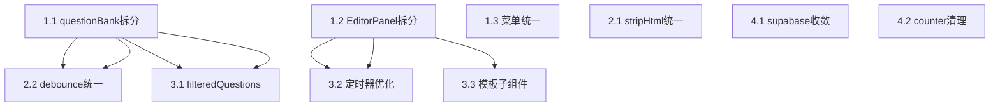

# Resume Builder 全面架构优化技术方案

## 总览

10 个优化点按依赖关系分为 4 个阶段。每个阶段内部可并行，阶段间有先后依赖。核心原则：**职责分明的模块架构 > 优雅的代码 > 功能的实现**。



---

## 阶段 1：架构拆分

### 1.1 questionBank.ts 拆分 (886行 -> ~5个文件)

**现状**：`src/stores/questionBank.ts` 单文件承担数据模型、持久化、归一化、过滤、云同步、业务操作六种职责。

**目标结构**：

```
src/stores/questionBank/
  types.ts           # 数据模型: Question, PracticeRecord, AiAnswerData, Chapter, 各类 Filter 类型
  normalizers.ts     # normalizeQuestion, normalizePracticeRecord, normalizeAiReview, normalizeAiAnswers 等
  persistence.ts     # loadAddedQuestions, saveAddedQuestions, loadPracticeRecords, savePracticeRecords,
                     #   loadAiAnswers, saveAiAnswers, clonePracticeRecords, cloneAiAnswers
                     # 统一使用 useDebouncedAutoSave 替代 3 套手写 watch+setTimeout（与 2.2 联动）
  filters.ts         # filteredQuestions 的纯函数实现: applyQuestionFilters(questions, filters) -> Question[]
                     #   消除 store 内 7 层串行 filter（与 3.1 联动）
  questionBankStore.ts  # 核心 store: state 定义 + 业务 action（addQuestion, upsertPracticeRecord 等）
                       #   云同步通过 createQuestionBankCloudManager 注入（保持现有模式）
  index.ts           # re-export useQuestionBankStore + 公共类型，保证调用方 import 路径不变
```

**关键决策**：
- `index.ts` 保持 `export { useQuestionBankStore } from './questionBankStore'`，所有调用方零改动
- 归一化函数是纯函数，无副作用，第一个抽离
- persistence.ts 内的 3 套 debounce watch 在此阶段先原样搬入，阶段 2.2 再统一替换
- 云同步 manager 的注入方式不变，只是 import 路径从 `./questionBankCloud` 改为相对路径

**验收**：`npm run build` + `npm run type-check` 通过；现有测试 `src/stores/__tests__/questionBank.test.ts` 全绿。

### 1.2 EditorPanel.vue 拆分 (1198行 -> 组件 + 3个 composable)

**现状**：`src/components/resume/EditorPanel.vue` 的 script 逻辑约 300 行，style 约 700 行，混入了完整度计算、拖拽排序、自动保存状态三种不相关逻辑。

**目标结构**：

```
src/components/resume/
  EditorPanel.vue              # 瘦身后 ~200行: 只保留模板编排 + style
  composables/
    useModuleCompletion.ts     # moduleCompletion + completionPercent computed
                              #   输入: store, 输出: { moduleCompletion, completionPercent }
    useModuleDragOrder.ts      # draggingModuleKey, dragOverModuleKey, handleSwitchDragStart/Over/Drop/End
                              #   输入: store, 输出: 拖拽状态 + 事件处理器
    useAutoSaveStatus.ts       # isAutoSavePending, autoSaveChipText, nowTick 管理
                              #   输入: store, 输出: 状态文案 + chip 状态
                              #   内部优化: 仅当 nextAutoSaveAt !== null 时启动定时器（与 3.2 联动）
```

**关键决策**：
- composable 放在 `src/components/resume/composables/` 下，与组件同级，不放到全局
- `useAutoSaveStatus` 在此阶段先搬入现有逻辑，阶段 3.2 再优化定时器行为
- style 暂不拆分，留在 `EditorPanel.vue` 内（700 行 CSS 是 scoped 的，拆出收益低于风险）

**验收**：`npm run build` 通过；编辑器面板功能（展开/收起、拖拽排序、模块开关、完整度显示、自动保存状态）手动验证无回归。

### 1.3 菜单类型统一

**现状**：`PrimaryMenuKey` 类型在 `src/App.vue` 和 `src/components/common/ModuleSidebar.vue` 各定义一遍。`primaryMenus` 数组（含 key/label/iconPath）只在 `ModuleSidebar.vue` 中定义。

**目标**：

```
src/constants/
  menus.ts   # export type PrimaryMenuKey = 'resume-editor' | 'ai-interviewer' | ...
             # export const PRIMARY_MENUS: ReadonlyArray<{ key: PrimaryMenuKey; label: string; iconPath: string }>
```

**关键决策**：
- 不引入 vue-router。当前 6 个面板的 `v-if/v-else-if` 切换在 App.vue 中仅 20 行，引入路由属于过度工程化
- `ModuleSidebar.vue` 从 `menus.ts` import `PRIMARY_MENUS`，`App.vue` import `PrimaryMenuKey` 类型
- 此项改动量最小，可独立于 1.1/1.2 执行

**验收**：`npm run type-check` 通过。

---

## 阶段 2：数据一致性

### 2.1 stripHtml 统一

**现状**：9 个文件各自实现 HTML 标签剥离逻辑。已有的 `src/services/htmlSanitizer.ts` 提供 `sanitizeHtml`（白名单清洗）和 `stripHtmlFallback`（正则剥离，但未导出）。

**目标**：

```
src/services/
  htmlUtils.ts   # export function stripHtml(html: string): string
                 #   实现: br -> \n, block tags -> \n, strip remaining tags, decode entities, collapse blank lines
                 #   复用 htmlSanitizer 中 stripHtmlFallback 的正则逻辑，补全实体解码和换行保留
  htmlSanitizer.ts  # 将 stripHtmlFallback 改为 import { stripHtml } from './htmlUtils'，保持向后兼容
```

**受影响文件**（9个，逐个替换为 `import { stripHtml } from '@/services/htmlUtils'`）：
- `src/services/aiService.ts` — 已有局部 `stripHtml` 函数，删除并改为 import
- `src/services/interviewService.ts` — 内联正则替换
- `src/services/exportInterviewPrep.ts` — 内联正则替换
- `src/services/exportMarkdown.ts` — 内联正则替换
- `src/components/ai/useApplyOptimizedContent.ts` — 内联正则替换
- `src/components/resume/EditorPanel.vue` — `hasTextContent` 函数内的正则
- `src/components/question-bank/QuestionReviewInsights.vue` — 内联正则替换
- `src/components/tech-interview/QuestionListItem.vue` — 内联正则替换
- `src/services/htmlSanitizer.ts` — `stripHtmlFallback` 改为委托

**关键决策**：
- 不合并到 `htmlSanitizer.ts`。sanitizer 的职责是安全清洗（白名单），stripHtml 的职责是纯文本提取，职责不同
- `stripHtml` 的行为以 `aiService.ts` 现有实现为准（最完整：处理 br、block tags、entities、blank lines）
- 浏览器环境优先用 DOMParser 提取 textContent，非浏览器环境 fallback 到正则

**验收**：`npm run build` + `npm run lint` 通过；AI 优化预览、导出 Markdown、导出面试准备 PDF 功能手动验证。

### 2.2 questionBank debounce watch 统一

**现状**：`src/stores/questionBank.ts`（拆分后为 `persistence.ts`）中 3 套手写的 `watch + setTimeout` debounce，而 `src/stores/useDebouncedAutoSave.ts` 已提供通用 composable。

**目标**：在拆分后的 `src/stores/questionBank/persistence.ts` 中，用 `useDebouncedAutoSave` 替换 3 套手写逻辑。

**伪代码**：

```typescript
// persistence.ts 内部
const addedQuestionsSaver = useDebouncedAutoSave({
  delayMs: 500,
  getSnapshot: () => addedQuestions.value,
  onScheduled: (nextSaveAt) => { /* 可选: 更新 UI 状态 */ },
  onSave: () => saveAddedQuestions(addedQuestions.value),
})
// practiceRecords、aiAnswers 同理
```

**关键决策**：
- `useDebouncedAutoSave` 的 `onScheduled` 回调目前 questionBank 不需要更新 UI（resume store 才用 `nextAutoSaveAt`），传入空函数即可
- 拆分后 `persistence.ts` 需要拿到 store 内部的 ref 引用，通过函数参数传入或返回 setup 函数
- 此项依赖 1.1 完成（persistence.ts 先存在）

**验收**：题库添加/删除题目、练习记录保存、AI 答案保存后，500ms 内 localStorage 正确写入。`npm run build` 通过。

---

## 阶段 3：性能优化

### 3.1 filteredQuestions 单次遍历

**现状**：`src/stores/questionBank.ts` 的 `filteredQuestions` computed 使用 7 层串行 `filter`，每次创建新数组。

**目标**：在拆分后的 `src/stores/questionBank/filters.ts` 中合并为单次遍历。

**伪代码**：

```typescript
export function applyQuestionFilters(
  questions: readonly Question[],
  filters: QuestionFilterState,
  helpers: { isReviewCandidate: (id: string) => boolean },
): Question[] {
  const q = filters.searchQuery?.toLowerCase()
  return questions.filter(item => {
    if (q && !buildQuestionSearchText(item).toLowerCase().includes(q)) return false
    if (filters.activeChapterId && item.chapterId !== filters.activeChapterId) return false
    if (filters.difficulty && item.difficulty !== filters.difficulty) return false
    if (filters.source !== 'all' && item.source !== filters.source) return false
    if (filters.mastery !== 'all') { /* check practice record */ }
    if (filters.label && !item.labels.includes(filters.label)) return false
    if (filters.projectName && !(item.projectNames?.includes(filters.projectName) ?? false)) return false
    if (filters.techStack && !(item.techStacks?.includes(filters.techStack) ?? false)) return false
    if (filters.view === 'resume-generated' && !isAiGenerated(item)) return false
    if (filters.view === 'review' && !helpers.isReviewCandidate(item.id)) return false
    return true
  })
}
```

**关键决策**：
- `QuestionFilterState` 接口聚合所有 filter 值，便于测试
- 此项依赖 1.1（filters.ts 先存在）
- 现有测试需验证过滤结果一致

**验收**：`src/stores/__tests__/questionBank.test.ts` 全绿；题库筛选功能手动验证。

### 3.2 EditorPanel 200ms 定时器优化

**现状**：`src/components/resume/EditorPanel.vue` 的 `autoSaveTicker` 每 200ms 触发 `nowTick.value = Date.now()`，即使没有待保存状态也持续运行。

**目标**：在拆分后的 `src/components/resume/composables/useAutoSaveStatus.ts` 中，改为条件启动。

**伪代码**：

```typescript
export function useAutoSaveStatus(store: ResumeStore) {
  const nowTick = ref(Date.now())
  let ticker: ReturnType<typeof setInterval> | null = null

  // 仅当存在待保存状态时启动定时器
  watch(
    () => store.nextAutoSaveAt !== null,
    (isPending) => {
      if (isPending && !ticker) {
        ticker = setInterval(() => { nowTick.value = Date.now() }, 200)
      } else if (!isPending && ticker) {
        clearInterval(ticker)
        ticker = null
      }
    },
    { immediate: true },
  )

  onUnmounted(() => { if (ticker) clearInterval(ticker) })
  // ... autoSaveChipText computed 不变
}
```

**关键决策**：
- `nowTick` 仍需更新以驱动 `autoSaveChipText` 的倒计时显示，但只在有 pending save 时才需要
- 此项依赖 1.2（useAutoSaveStatus 先存在）

**验收**：编辑简历内容后，倒计时正常显示；无编辑时定时器不运行（可通过 DevTools Performance 面板验证）。

### 3.3 模板组件提取公共子组件

**现状**：9 个模板组件（如 `src/templates/resume/green-icon-linear/ResumeTemplate.vue` 623行）存在大量重复的教育条目、工作条目、项目条目渲染逻辑。

**目标**：

```
src/templates/shared/
  components/
    EducationSection.vue   # 教育经历渲染: 接收 educationList + moduleOrderStyle，输出 HTML
    WorkSection.vue        # 工作经历渲染
    ProjectSection.vue     # 项目经历渲染
    AwardSection.vue       # 荣誉奖项渲染
    SkillsSection.vue      # 专业技能渲染 (v-html)
    SelfIntroSection.vue   # 个人简介渲染 (v-html)
```

**关键决策**：
- 子组件只负责渲染，不依赖 store，通过 props 接收数据
- 各模板组件用 `<EducationSection :list="store.educationList" :style="moduleOrderStyle('education')" />` 替换内联 HTML
- 此项改动量最大但风险最低（纯展示组件），可作为低优先级任务
- 不强制所有模板立即迁移，可逐个模板替换

**验收**：逐个模板对比替换前后渲染结果一致；`npm run build` 通过。

---

## 阶段 4：工程规范

### 4.1 supabase import 收敛

**现状**：`src/stores/resume.ts` 直接 import 10 个 supabase 函数。

**目标**：在 `src/stores/resumeCloud.ts` 中统一引入并组装为 API 对象导出，`resume.ts` 只从 `resumeCloud.ts` import。

**伪代码**：

```typescript
// resumeCloud.ts
import { signUp, signIn, ..., deleteResume, type ResumeRecord } from '@/services/supabase'

export const resumeCloudApi = { signUp, signIn, signOut, getResumes, getActiveResume,
  createResume, updateResume, setActiveResume, deleteResume }
export type { ResumeRecord }

// resume.ts
import { resumeCloudApi, type ResumeRecord } from './resumeCloud'
// cloudManager 的 api 参数直接传 resumeCloudApi
```

**验收**：`npm run type-check` 通过；云同步功能（登录、版本管理、保存到云端）手动验证。

### 4.2 counter.ts 清理

**现状**：`src/stores/counter.ts` 是脚手架默认生成的示例 store，13 行，无任何调用方。

**目标**：删除文件。

**验收**：`npm run build` 通过；`rg 'useCounterStore' src/` 无结果。

---

## 执行顺序与依赖



- **可立即并行**：1.1、1.2、1.3、2.1、3.3、4.1、4.2 互不依赖
- **有依赖**：2.2 依赖 1.1；3.1 依赖 1.1；3.2 依赖 1.2
- **建议批次**：第一批做 1.1+1.2+1.3+2.1（高优先级架构拆分）；第二批做 2.2+3.1+3.2（依赖第一批）；第三批做 3.3+4.1+4.2（低风险收尾）

## 验收命令

每个阶段完成后统一执行：
```bash
npm run type-check   # TypeScript 编译无错误
npm run build        # 完整构建通过
npm run lint         # lint 无新增错误
```